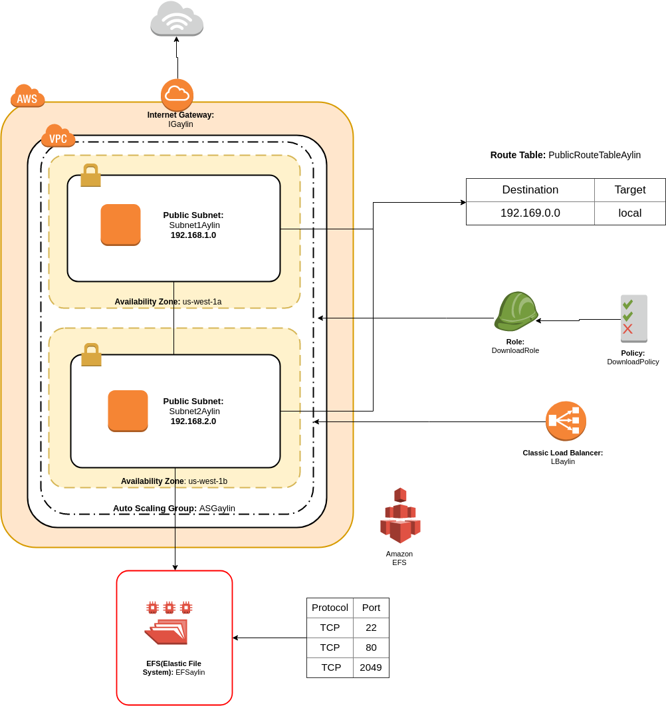
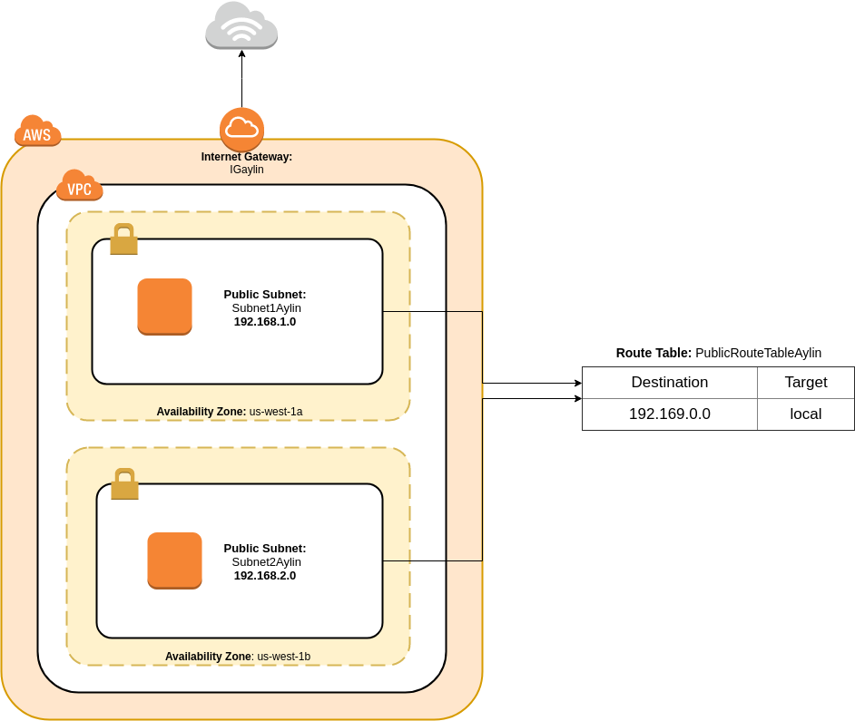
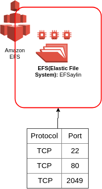
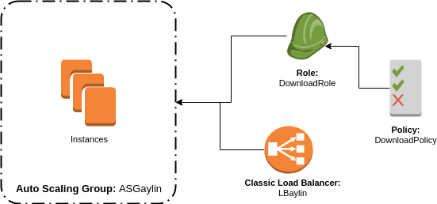

# CLOUDFORMATION EXERCISE:

The following project shows a infraestructure clouds based. AWS cloudformation is characterized by describing the 
infraestructure resources within a JSON or YAML file, it helps to standardized components that can be reused
quickly ([AWS CloudFormation](https://aws.amazon.com/cloudformation/?nc1=h_ls) ), in this project we are using the following componentes:
> - VPC     
> - Subnets     
> - Security Group     
> - Internet Gateway     
> - File System  
> - Roles     
> - Launch Configuration     
> - AutoScaling Group     
> - Load Balancer

The infrastructure is divided into 4 nested stacks that found in different YAML files defined below:

## Stack-Aylin.yml file:
___

It is the main file or the root of all nested stacks. In this file the call of the other stacks is made consecutively,
each stack depends of the previous one. 

## Stack-VPC.yml file:
___

This file contains a VPC that allows to launch resources. Within it are added the 2 subnets, which are in different availability zones **(us-west-2a, us-west-2b)** and then be used by the load balancer. It also has internet access, so that the instances can communicate through the internet gateway. The subnets are in a public routing table so they can be accessed without any problem.

## Stack-EFS.yml file:
___
This file has the following parameters:
> - VPCid
> - Subnet1
> - Subnet2
>
These parameters refer to the ids of the components returned by the VPC stack. With them the Security Group is created that allows access to the Http, nfs and tcp protocols. Adding the Security Group to each subnet. The file system will also be created and then added to the autoscaling group.

## Stack-EC2.yml file:
___
This file has the following parameters:
> - SecurityGroupVPC
> - Subnet1
> - Subnet2
> - EFSaylin

These parameters refer to the ids of the components returned by the VPC and EFS stacks. 
In this last file a role is created to be able to access the project that is in a bucket in S3, 
with the policies to download it. A launch configuration is also created with the user data to be able to mount the file system created in the Stack-EFS.yml file in the path /mnt/efs, then an Apache web server is installed to be able to run the project that is in the bucket of S3. Already having the created the launch configuration is attached to the autoscaling group with a minimum of 2 instances. Finally, the load balancer is added to the autoscaling group.

### **NOTE:** You can test using the load balancer dns.